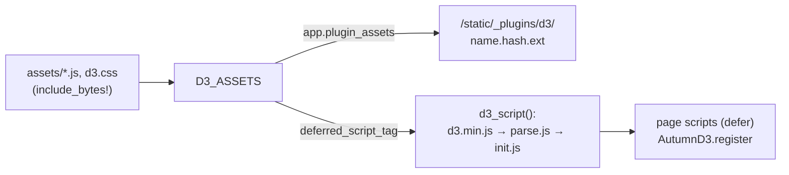

# ADR 0001: Serve the D3 UMD build with classic deferred scripts

- Status: accepted
- Date: 2026-10-07
- Applies to: autumn-plugin-d3 0.1.0, autumn-web 0.8.0

## Context

D3 7.9.0 ships one UMD file (`dist/d3.min.js`, sets `window.d3`) and ES
modules split over 30 packages. ES modules need an import map for bare
specifiers. An import map is an inline script. The default Autumn CSP
(`script-src 'self'`) blocks it. Autumn 0.8 gives plugins `PluginAssets`:
hashed URLs, SRI, ETag, and Range.

## Decision

- Vendor `dist/d3.min.js` unchanged. Pin its `sha384` in
  `D3_JS_INTEGRITY`, `assets/manifest.json`, and `scripts/vendor.sh`.
- One bundle, `D3_ASSETS` (`PluginAssets::from_files`, namespace `d3`):
  `d3.min.js`, `parse.js`, `init.js`, `d3.css`. Do not serve
  `manifest.json` or `D3-LICENSE`.
- `d3_script()` emits three classic `defer` scripts at hashed URLs with
  SRI. Deferred scripts run in document order.
- `parse.js` is a UMD-style file: `self.AutumnD3Parse` in the browser,
  `module.exports` in Node tests.
- `init.js` starts on `DOMContentLoaded`, so later deferred page scripts
  can register kinds and listen for `d3:ready`.

## Consequences

- No import map, no inline script. Full SRI on every tag.
- Pages load all of D3 (280 KB, cached as immutable). Tree shaking is not
  possible without a bundler.
- Custom code must use `window.d3` and load after `d3_script()`.
