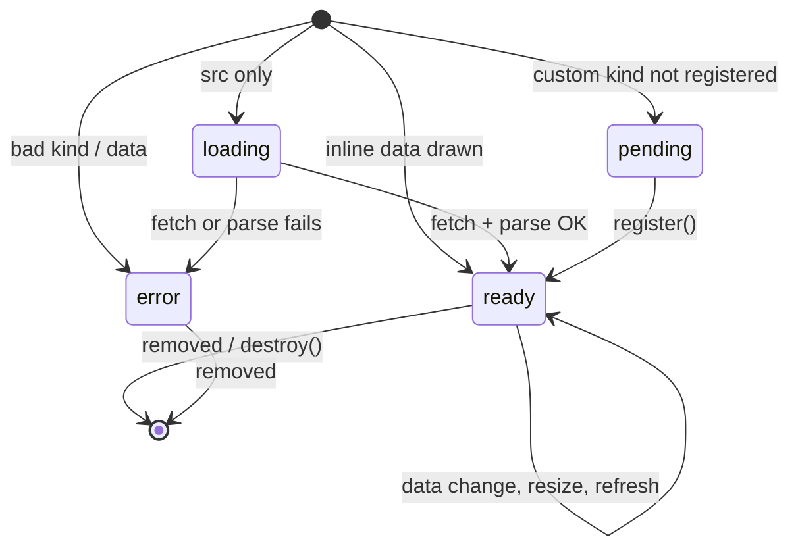

# ADR 0002: One declarative runtime reads `data-d3-*` attributes

- Status: accepted
- Date: 2026-10-07

## Context

Autumn renders HTML on the server. htmx swaps parts of it. Charts must
start, update, and stop with the DOM. Rust must not emit JavaScript.

## Decision

- The Rust builder `Chart<K>` writes attributes only. `init.js` is the
  single interpreter. `parse.js` holds the attribute names and limits.
  Tests check that both sides know the same names.
- Kinds are type parameters (`Bar`, `Line`, `Area`, `Scatter`, `Pie`,
  `Custom`). Marker traits (`Axes`, `Xy`, `Curved`) gate options at
  compile time.
- Data is JSON in `data-d3-data`, or same-origin JSON from `data-d3-src`.
  Non-finite numbers are `null`; the runtime shows a gap.
- Lifecycle: scan on `DOMContentLoaded`, `htmx:afterSwap`, and DOM
  insertion (`MutationObserver`). A `data-d3-data` change animates in
  place. Any other `data-d3-*` change rebuilds. Removal frees the
  observers, timers, and requests. A `Map` keeps one state per element.
- Custom kinds: `AutumnD3.register(name, draw)`. Charts of an unknown
  custom kind wait in state `pending`.

## Consequences

- Hand-written markup works the same as builder output.
- One bad chart fails alone. The fallback table stays.
- A rebuild fires `d3:ready` again. A data update fires `d3:render` only.
